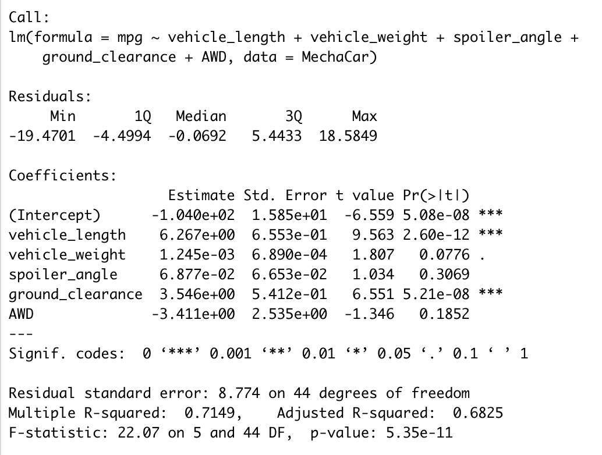
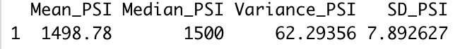
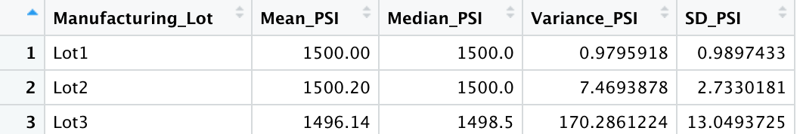
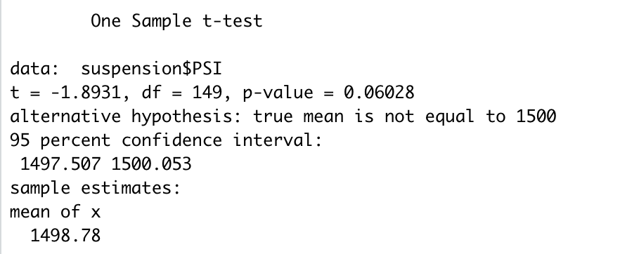
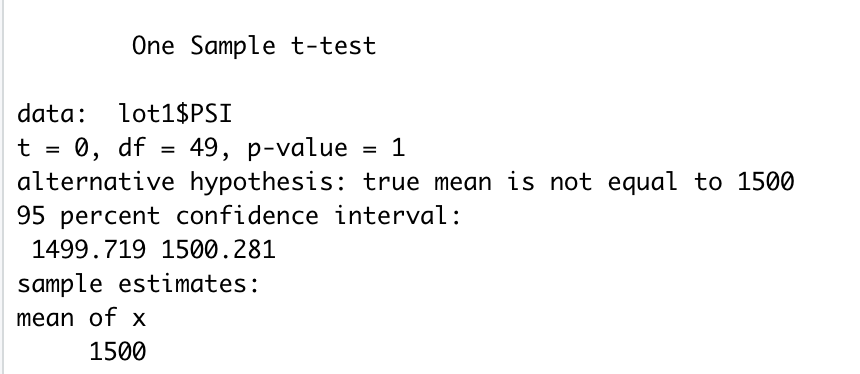
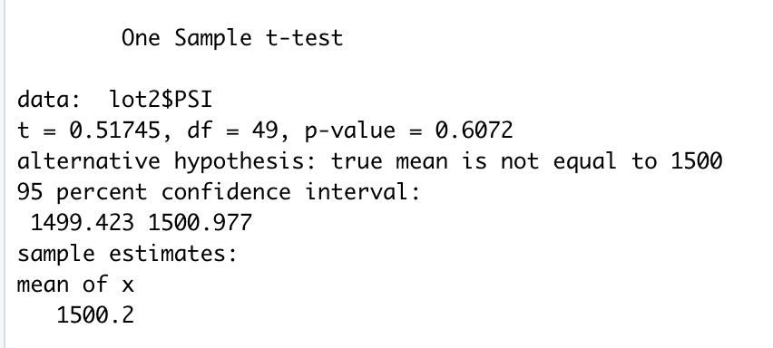
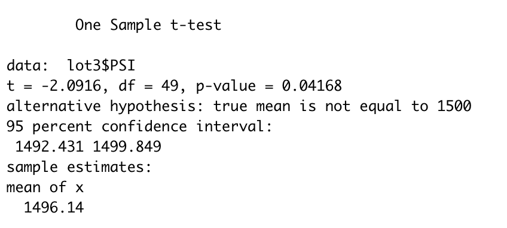

# MechaCar Statistical Analysis

## Linear Regression to Predict MPG

Below is a screenshot of the statistical summary of the output from the linear regression.

Looking at the summary fit for this linear regression model, I found that the three most significant predictors of MPG from this dataset are vehicle_length, vehicle_weight, and ground_clearance. Vehicle_weight is a significant predictor at the 0.1 significance level, while vehicle_length and ground_clearance variables are extremely significant at the 0 significance level. These three coefficients provide a non-random amount of variance to the MPG values in the dataset. 

The p-value of our linear regression analysis is 5.35e-11, which is significantly smaller than our assumed significance level of 0.05%. Thus, I can state that there is sufficient evidence to reject our null hypothesis, which means that the slope of our linear model is not zero. 

The summary fit showed a r-squared value of 0.715, which means that roughly 71.5% of the variability of MPG is explained using this linear regression model on vehicle_length, vehicle_weight, spoiler_angle, ground_clearance, and AWD. This high r-squared value shows that this linear mjodel predicts MPG of MechaCar prototypes effectively. 

## Summary Statistics on Suspension Coils

Below is a screenshot of the data frame of summary statistics for the suspension coil's PSI column.

As you can see, the mean suspension coil PSI is about 1499, which is close to the median suspension coil PSI value of 1500. The variance for suspension coil PSI's is about 62.3, with a standard deviation of about 7.9. 

Below is a screenshot of the data frame of summary statistics for for the suspension coil's PSI column by lot. 

As you can see above, the mean suspension coil PSI's for lot 1 and lot 2 are both 1500, while lot 3 has a mean of about 1496. The highest variance and standard deviation are for lot 3, and the lowest respectively for lot 1. 

The design specifications for the MechaCar suspension coils dictate that the variance of the suspension coils must not exceed 100 pounds per square inch. The current manufacturing data meets this design specification for all maunfacturing lots in total, as the total variance was 62.4. However, the current manufacturing data does not meet this design specification for each lot individually, as the variance for lot 3 exceeds 100, at about 170.3 pounds per square inch. 

## T-Tests on Suspension Coils

The photo above shows the results of the t-test to see if the total suspension PSI is statistically different from the population mean of 1,500 pounds per square inch. I found that with a p-value of 0.0603, we reject the null hypothesis. Thus, we have weak evidence to conclude that the true total suspension coil PSI mean is not equal to 1,500 pounds per square inch, at the 0.05 significance level.  

This photo shows the results of the t-test to see if the suspension PSI for lot 1 is statistically different from the population mean of 1,500 pounds per square inch. I found that with a p-value of 1, we fail to reject the null hypothesis at the 0.05 significance level. Thus, we have no eviddence that the true mean PSI for lot 1 is not equal to 1,500 pounds per square inch. 

This photo shows the results of the t-test to see if the suspension PSI for lot 2 is statistically different from the population mean of 1,500 pounds per square inch. I found that with a p-value of 0.607, we fail to reject the null hypothesis at the 0.05 significance level. Thus, we have no eviddence that the true mean PSI for lot 2 is not equal to 1,500 pounds per square inch. 

This photo shows the results of the t-test to see if the suspension PSI for lot 3 is statistically different from the population mean of 1,500 pounds per square inch. I found that with a p-value of 0.042, we reject the null hypothesis at the 0.05 significance level. Thus, we have evidence that the true mean PSI for lot 3 is not equal to 1,500 pounds per square inch. 

## Study Design: MechaCar vs Competition

There are numerous factors that consumers take into consideration when finding the right car for them to purchase. With all of the new competition, I am focusing my statistical study on the purchasing price of MechaChar vs competitors. 

Metrics to test:
- Selling Price: Dependent Variable
- Engine: Independent Variable
- MPG: Independent Variable
- Average Maintenance Costs: Independent Variable
- Resale Value: Independent Variable

Hypotheses:
- Null Hypothesis (Ho): MechaCar's selling price is similar to those of competitors
- Alternative Hypothesis (Ha): MechaCar's selling price is significantly below those of competitors

Statistical Test:
The best statistical test for this study would be two-sample t-tests, as we are comparing data on various manufacturers, and comparing the selling prices. 

Data: 
I would need to gather data on each variable for MechaCar and other competitors, from various years and locations of purchase. 

